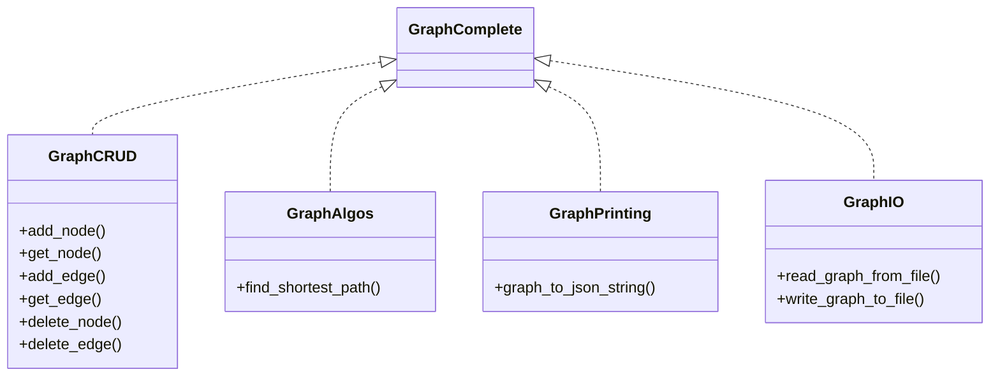

# Discussion - How to Design Rust Applications

After having read the Rust Book, watched a few YouTube channels on Rust you might have gotten really intrigued by the idea of coding an application in Rust.
The language is strangely fascinating: using safe Rust gets you an application that is practically guaranteed to be memory safe. It comes with a surprisingly
large collection of libraries for practically all purposes.

So you, you start programming but soon you find out that nothing can be done the same way as you did when you programmed in C, C++, or any other programming language. Problem number 1: The infamous borrow checker driving you insane. Your first programming endeveaors will probably also leave you scratching your head which of the many different ways to reference data you should use: mutable and non-mutable references, smart pointers such as boxes and ref counts, and their thread-safe counterparts, and then there is the RefCell as well.
For every simple thing like for example iterating over the elements of a container takes you half an hour to figure out what the most Rustatonic way of doing this is.
Finally, the lack of polymorphism requires changing your programming behavior. And it takes a while to understand the subtle differences between interfaces and traits.
In any case, once mastered, Rust opens the door to writing very compact applications. The many libraries and bindings to libraries such GUI frameworks makes it quite fun to develop your Apps. In Rust you can address tiny devices as well as desktops or servers.

In this series of articles we are discussing some design concepts you have to get familiar with if you want to succeed writing somewhat complex applications.

For this purpose, we give ourselves the task to write a generic graph library:

## Reference Problem

### Description

Write a basic graph library allows you to organize data in a directed graph. The graph can be big consisting of hundreds of thousands of nodes and millions of edges. Nevertheless, the library shall only target in memory graphs. In other words, the graph shall be loaded in its entirety into RAM.

### Functional Requirements

The library shall provide APIs for:

1. node and edge CRUD operations
2. graph algorithms such as path finding, shortest path, spanning tree, etc.
3. printing nodes and edges and potentially the entire graphs in JSON format into a string
4. reading and persisting data from a simple file in JSON format

### Non-functional requirement - replaceable implementations

Make sure that you design the library in such a way that it is possible to add other implementations for the above outlined APIs in the future. As an example, a future implementation might be required that can deal with graphs that are too big to fit in memory and hence require an implementation that includes persistent storage.

### Write an application that uses the library

We want to try out our library on Open-Street-Map data (osm files):

- Application 1:  Our application shall be a command line application, that loads an OSM file, and searches for the shortest path between two nodes. The application shall take the name of the OSM file as input as well as the IDs of the two places for which we want to have the path. It shall print out the path between the two places.

Application 2: Write an application that finds the two places (nodes) with the longest distance between them. This function shall take the OSM file as input and print out the ids of the two places that have the longest path between them. We want to also have a printout of that path.

Full disclosure: There is of course a library already available that provides you with graph algorithms (TODO: link). We are not using this library because we want to practice our coding skills and have a decent Rust design discussion.

## Diskussion of the problem space

Our goal is to realize a graph library that can handle large graphs in memory. This means that although all data is in memory we need some efficient lookup mechanisms (ideally O1, with low memory overhead).

A graph typically consists of nodes and edges: `G = (N, E)`. Let's discuss some first thoughts on how we could implement such a graph:

### Defining APIs

Based on the problem statement above, let's create some Rust APIs. Rust does not provide interfaces, but we can use traits instead:

```rust

// Code to be copied in

```

Probably, the API is not yet styled very much like a Rust library, but we can do that later asking a GenAI for help with that. A noticable thing is that our trait is quite large. Assuming that more functions have to be added (e.g. many many graph algos, more convinience functions for CRUD ops, printing, and IO) this can become quite a big thing. Also, maybe you don't need all this stuff. Therefore we want to break this interface up into a couple of independent interfaces:



The Rust code for this could look like this:

```rust

// code to be copied in

```

## Discussion of an implementation

