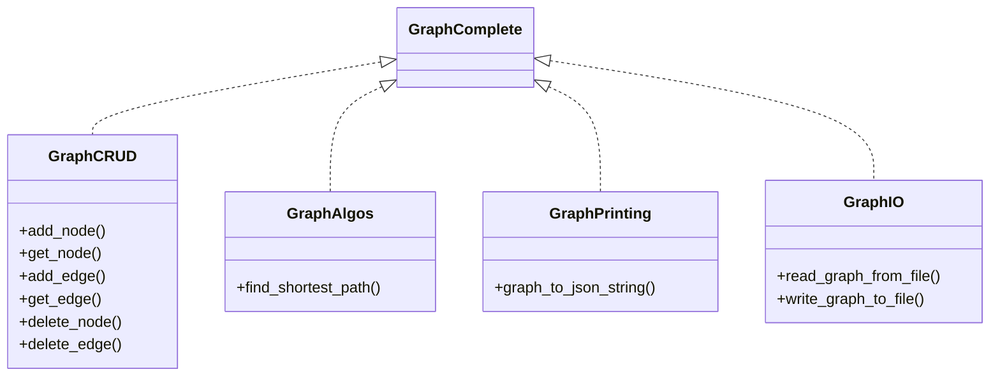

# Discussion - How to Design Rust Applications

After having read the Rust Book, watched a few YouTube channels on Rust you might have gotten really intrigued by the idea of coding an application in Rust.
The language is strangely fascinating: using safe Rust gets you an application that is practically guaranteed to be memory safe. It comes with a surprisingly
large collection of libraries for practically all purposes.

So you, you start programming but soon you find out that nothing can be done the same way as you did when you programmed in C, C++, or any other programming language. Problem number 1: The infamous borrow checker driving you insane. Your first programming endeveaors will probably also leave you scratching your head which of the many different ways to reference data you should use: mutable and on-mutable references, smart pointers such as boxes and ref counts, and their thread-safe counterparts, and then there is the RefCell as well.
For every simple thing like for example iterating over the elements of a container takes you half an hour to figure out what the most Rustatonic way of doing this is.
Finally, the lack of polymorphism requires changing your programming behavior. And it takes awhile to understand the subtle differences between interfaces and traits.
In any case, once mastered, Rust opens the door to writing very compact applications. The many libraries and bindings to libraries such GUI frameworks makes it quite fun to develop your Apps. In Rust you can address tiny devices as well as desktops or servers.

In this series of articles we are discussing some design concepts you have to get familiar with if you want to succeed writing somewhat complex applications.

For this purpose, we give ourselves the task to write a generic graph library:

## Reference Problem

### Description

Write a basic graph library allows you to organize data in a directed graph. The graph can be big consisting of hundreds of thousands of nodes and millions of edges. Nevertheless, the library shall only target in memory graphs. In other words, the graph shall be loaded in its entirety into RAM.

### Functional Requirements

The library shall provide APIs for:

1. node and edge CRUD operations
2. graph algorithms such as path finding, shortest path, spanning tree, etc.
3. printing nodes and edges and potentially the entire graphs in JSON format into a string
4. reading and persisting data from a simple file in JSON format

### Non-functional requirement:

Make sure that you design the library in such a way that it is possible to add other implementations for the above outlined APIs in the future. As an example, a future implementation might berequired that can deal with graphs that are too big to fit in memory and hence require an implementation that includes persistent storage.

### Write an application that uses the library

We want to try out our library on Open-Street-Map data (osm files). Our application shall be a command line application, that loads an OSM file, and searches for the shortest path between two nodes. The application shall take the name of the OSM file as input as well as the IDs of the two places for which we want to have the path. It shall print out the path between the two places.

In a second step we want to write an application that findes the two places with the longest distance between them. This function shall take the OSM file as input and print out the ids of the two places that have the longest path between them. We want to also have a printout of that path.

Full disclosure: There is of course a library already available that provides you with graph algorithms (TODO: link). We are not using this library because we want to practice our coding skills and have a decent Rust design discussion.

## Comparing Rust to other Programming Languages

In this article we are going to approach the problem in both C++ as well as Rust so that we can compare the two programming languages and point out how you have to change your approach to solve this problem in a Rustationian way.

## Diskussion of the problem space

Our goal is to realize a graph library that can handle large graphs in memory. This means that although all data is in memory we need some efficient lookup mechanisms (ideally O1, with low memory overhead).

A graph typically consists of nodes and edges: `G = (N, E)`. Let's discuss some first thoughts on how we could implement such a graph:

### Defining APIs

Based on the problem statement above, let's create some APIs. C++ does not provide interfaces, but we can use pure virtual classes instead:

```c++
// first version

struct EdgeData {
    NodeRef from;
    NodeRef to;
    Weight weight;
}

// using NodeRef = ??? yet to be defined
// using EdgeRef = ??? yet to be defined
using Path = std::vector<NodeRef>;

template<T>
class IGraph<T> {
public:
    // --- CRUD ops ---
    virtual NodeRef add_node(T& value) =0;
    virtual EdgeRef add_edge(EdgeData &edge_data) =0;
    virtual void delete_node(NodeRef n_ref) =0;
    virtual void delete_edge(EdgeRef e_ref) =0;
    virtual T* get_node(NodeRef n_ref) =0;
    virtual EdgeRef* get_edge(EdgeRef e_ref) =0;
    virtual const T* get_node(NodeRef n_ref) const =0;
    virtual const EdgeRef* get_edge(EdgeRef e_ref) const =0;

    // --- Graph Algos ---
    virtual std::vector<NodeRef> find_shortest_path(NodeRef from, NodeRef to) =0;
    // ... could be more

    // --- printing to string ---
    virtual std::string node_to_json_string(NodeRef node) =0;
    virtual std::string edge_to_json_string(EdgeRef edge) =0;
    virtual std::string graph_to_json_string() =0;
    // ...

    // --- IO functions
    virtual static Graph *read_graph_from_file(std::string path_to_file) =0;
    virtual void write_graph_to_file(std::string path_to_file) =0;
}
```

Obviously the printing functions are not yet styled in a C++ way (making them nicely ostream compatible), but we can do that later asking a GenAI for help with that. A Noticable thing is that our pure virtual interface description is quite large. Assuming that more functions have to be added (e.g. many many graph algos, more convinience functions for CRUD ops, printing, and IO) this can become quite a class. Also, maybe you don't need all this stuff. Therefore we probably want to break this interface up into a couple of independent interfaces:



The C++ code for this could look like this:

```c++
template<T>
class IGraphCRUD<T> {
public:
    // --- CRUD ops ---
    virtual NodeRef add_node(T& value) =0;
    virtual NodeRef set_node(NodeRef ref, T& value) =0;
    virtual EdgeRef add_edge(EdgeData &edge_data) =0;
    virtual void delete_node(NodeRef n_ref) =0;
    virtual void delete_edge(EdgeRef e_ref) =0;
    virtual T* get_node(NodeRef n_ref) =0;
    virtual EdgeRef* get_edge(EdgeRef e_ref) =0;
    virtual const T* get_node(NodeRef n_ref) const =0;
    virtual const EdgeRef* get_edge(EdgeRef e_ref) const =0;
}

template<T>
class IGraphAlgos<T> {
public:
    // --- Graph Algos ---
    virtual std::vector<NodeRef> find_shortest_path(NodeRef from, NodeRef to) =0;
    // ... could be more

template<T>
class IGraphPrinting<T> {
public:
    // --- printing to string ---
    virtual std::string node_to_json_string(NodeRef node) =0;
    virtual std::string edge_to_json_string(EdgeRef edge) =0;
    virtual std::string graph_to_json_string() =0;
    // ...
}

template<T>
class IGraphIO<T> {
public:
    // --- IO functions
    virtual static Graph *read_graph_from_file(std::string path_to_file) =0;
    virtual void write_graph_to_file(std::string path_to_file) =0;
}
```

An class could implement all these interfaces thus providing a full-fledged Graph Library.

```c++


```


### Option 1: Nodes hold references to all edges that start/ end with them

This is a naive way of programming this in Rust:

```rust
// Do NOT write code like this!

struct Graph<T> {
    nodes : Vec<Node<T>>,
}

struct Node<T> {
    value : T,
    edges : Vec<Edge<T>>,
}

struct Edge<T> {
    weight : i32,
    from : &Node<T>,
    to : &Node<T>,
}
```

This is obviously a bad idea. The borrow checker will be very unhappy with you and for good reason. In this approach we store the nodes in a vector. The edges are designed to hold references to those nodes. You could do this in C++ without having the compiler giving you any warning or error, but you would still writing dangerously unsafe code:

```c++
// Do NOT write code like this!

class Node<T> {
    T value;
    std::vector<Edge<T>>,
}

class Node<T>;

class Edge<T> {
    int weight;
    Node<T> *from;
    Node<T> *to; 
}

class Node<T> {
    T value;
    std::vector<Edge<T>*> edges; 
}

```

The problem with this approach is that your vector can get reallocated at any time: When you reach the maximum capacity of your vector when you push a new element it will get re-allocated, and all values moved to the re-allocated position in memory.

Let us assume that you want to keep the data in continuous memory because you anticipate iterating over it frequently in the given order and you want to profit from better caching, then the obvious approach is to rely on the index in the array instead:

```rust
pub type NodeId = usize;
pub type Weight = i32;

struct Graph<T> {
    nodes : Vec<Node<T>>,
}

struct Node<T> {
    value : T,
    edges : Vec<Edge<T>>,
}

struct Edge<T> {
    weight : Weight,
    from : NodeId,
    to : NodeId,
}
```

For clarity we typedef'ed `NodeId` to `usize` to make it clearer how this is data structure is supposed to be used. We did the same for the type of the weight, just to improve readability.
You could realize a graph in the same way in C++:

```c++
using NodeId = usize;
using Weight = int;

class Node<T> {
    T value;
    std::vector<Edge<T>>,
}

class Node<T>;

class Edge<T> {
    Weight weight;
    NodeId *from;
    NodeId *to; 
}

class Node<T> {
    T value;
    std::vector<Edge<T>*> edges; 
}
```

This should work and be safe.

If you are like me you would probably be intrigued to explore possibilities to use pointers instead. Just because there is the nagging question: Wouldn't a pointer express this clearer? As a C++ guy moving into the Rust territory my thought would go be: How do I get this into the heap memory? In C++ I have the `new` function for that purpose.

Well, in Rust we only have Smart Pointers to put stuff on the heap. Now the question is: Which one to choose? `Box`, `Rc`, or the atomic `Arc`? Remembering that we foresee that the dataset might be really big, we could expect to write parallelized algorithms to deal with large data. Hence, let's go with Arc.

```rust
pub type Weight = i32;

struct Graph<T> {
    nodes : Vec<Arc<Node<T>>>,
}

struct Node<T> {
    value : T,
    edges : Vec<Arc<Edge<T>>>,
}

struct Edge<T> {
    weight : Weight,
    from : Arc<Node<T>>,
    to : Arc<Node<T>>,
}
```

Naturally, we can do something similar in C++:

```c++
using NodeId = usize;
using Weight = int;

class Node<T> {
    T value;
    std::vector<std::shared_ptr<Edge<T>>>,
}

class Node<T>;

class Edge<T> {
    Weight weight;
    std::shared_ptr<Edge<T>> from;
    std::shared_ptr<Edge<T>> to; 
}

class Node<T> {
    T value;
    std::vector<shared_ptr<Edge<T>> edges; 
}
```

Note that we are not using `std::atomic<std::shared_ptr<t>>`. This is because the access to the pointer control block is by definition atomic. Only changes to the content of the smart pointer is not protected.


